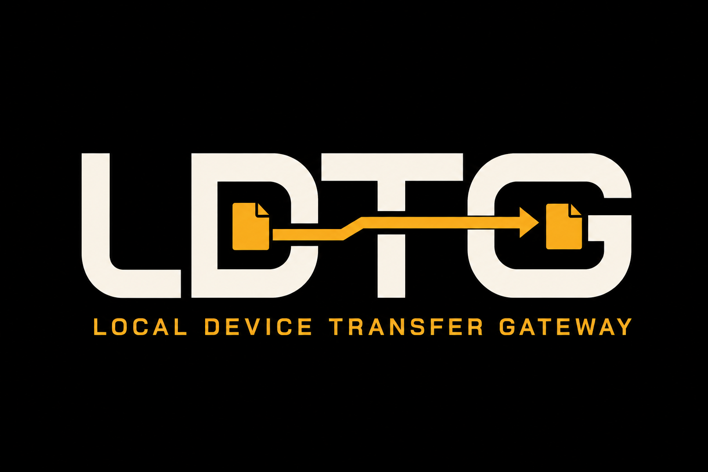

# LDTG



**Local Device Transfer Gateway** überträgt Dateien direkt zwischen einem
Windows-PC und Mobilgeräten im selben lokalen Netzwerk. Die Desktop-App stellt
ausgewählte Ordner bereit; auf dem Handy genügt ein Browser. Es gibt kein
Cloudkonto und keinen externen Datei-Upload.

Aktueller Stand: `0.3.0-rc.2` ist als unsignierter Public-Beta-Kandidat geprüft,
aber noch nicht öffentlich freigegeben. Deshalb gibt es derzeit keinen
offiziellen öffentlichen Download.

## Funktionen

- Dateien aus einem ausgewählten PC-Ordner auf das Handy laden;
- neue Dateien vom Handy in einen getrennten PC-Eingangsordner hochladen;
- mehrere Freigabeprofile speichern und schnell wechseln;
- aktive Geräte und Übertragungen am PC sehen und trennen;
- Uploads pausieren, fortsetzen, abbrechen oder erneut versuchen;
- Zugang über einen kurzlebigen achtstelligen Code;
- Netzwerk, Port, Größen- und Dateigrenzen kontrolliert konfigurieren;
- tatsächliche installierte App-Version dauerhaft in der Seitenleiste sehen.

## Unterstützter Beta-Umfang

- Windows 11 25H2 auf x64 mit aktuellen Sicherheitsupdates und WebView2;
- real geprüfter Mobilclient: Android 16 mit Firefox;
- direkte Verbindung im ausdrücklich vertrauten privaten LAN.

Andere Browser und mobile Systeme können funktionieren, sind für die erste Beta
aber nicht als getestet zugesichert. Windows 10, andere Desktopbetriebssysteme,
NAS-Freigaben, Internetexposition, Portweiterleitung und nicht vertrauenswürdige
Netze werden nicht unterstützt. Einzelheiten stehen in [SUPPORT.md](SUPPORT.md).

## Verwendung

1. Downloadordner und/oder Upload-Eingang auswählen.
2. Netzwerk, Port und Grenzen prüfen und die Firewallregel einmalig einrichten.
3. Den Dienst nur in einem vertrauten Netzwerk starten.
4. Angezeigte Adresse oder QR-Code am Handy öffnen und den separat angezeigten
   Zugangscode eingeben.
5. Dateien übertragen und den Dienst danach wieder stoppen.

Der Uninstaller entfernt nach bestätigter Administratorabfrage die
LDTG-Firewallregel. Einstellungen, Logs und ausgewählte Freigabeordner bleiben
bewusst erhalten und werden nicht rekursiv gelöscht.

## Wichtige Sicherheitshinweise

LDTG v1 verwendet gehärtetes **HTTP im vertrauenswürdigen LAN**, aber keine
Transportverschlüsselung. Andere Teilnehmer oder Administratoren des lokalen
Netzes könnten Datenverkehr grundsätzlich mitlesen oder manipulieren. LDTG
darf deshalb nicht über das Internet freigegeben und nur in einem bewusst
bestätigten Netzwerk gestartet werden.

- Downloadfreigaben sind ausschließlich lesbar.
- Uploads legen nur neue Dateien an und überschreiben keine vorhandenen Dateien.
- Der Inhalt des Upload-Eingangs wird Mobilgeräten nicht aufgelistet.
- Start, Stopp, Konfiguration, Firewall und Diagnose sind nicht über die LAN-API
  erreichbar.
- Zugangscodes und Sitzungstoken erscheinen weder in URL/QR-Code noch in Logs.
- LDTG führt empfangene Dateien nicht aus, enthält aber keinen Virenscanner.

Das vollständige Modell, Meldewege und die lokale Datenverarbeitung beschreiben
[SECURITY.md](SECURITY.md), [docs/THREAT_MODEL.md](docs/THREAT_MODEL.md) und
[docs/PRIVACY.md](docs/PRIVACY.md).

## Entwicklung

Benötigt werden Node.js `24.19.0`, pnpm `11.19.0`, Rust `1.98.0` mit MSVC,
Visual Studio 2022 Build Tools und WebView2.

```powershell
pnpm install --frozen-lockfile
pnpm check
pnpm dev
```

`pnpm check` prüft generierte Verträge und Drittanbieterhinweise, TypeScript,
ESLint, Frontendtests mit Coverage, beide Webbuilds, Rusttests, Formatierung und
Clippy. Der unsignierte Windows-Installer wird lokal mit `pnpm build` erzeugt.
Releasebuild, SBOM und Prüfsummen sind in
[docs/PRIVATE_RELEASE.md](docs/PRIVATE_RELEASE.md) beschrieben.

```text
apps/desktop       Tauri-Desktopoberfläche
apps/mobile        eingebettete responsive Handyoberfläche
packages/shared    aus Rust generierte TypeScript-Verträge
src-tauri/domain   Einstellungen, Netzwerk- und Dateisystemgrenzen
src-tauri/service  LAN-Server, Sitzungen und Übertragungsprotokoll
src-tauri/platform Windows-Firewall- und Netzwerkcode
```

## Dokumentation

Der [Dokumentationsindex](docs/README.md) trennt Bedienung, technische Referenz,
Release-Unterlagen und historische Nachweise. Der aktuelle Release-Nachweis steht
in [docs/RELEASE_NOTES_0.3.0-rc.2.md](docs/RELEASE_NOTES_0.3.0-rc.2.md).

Fehlerberichte und Funktionsvorschläge sind nach einer Veröffentlichung über
Issues willkommen. Pull Requests sind zunächst nicht geöffnet; siehe
[CONTRIBUTING.md](CONTRIBUTING.md).

## Lizenz

LDTG steht unter der [Apache License 2.0](LICENSE), Copyright © 2026
Kordariel666. Drittanbieterkomponenten behalten ihre jeweiligen Lizenzen. Die
vollständigen Hinweise stehen in [THIRD_PARTY_NOTICES.md](THIRD_PARTY_NOTICES.md).
