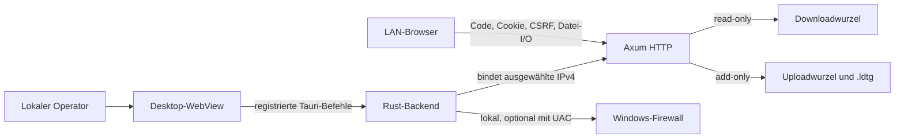

# Aktuelles Bedrohungsmodell von LDTG v1

Status: quellgestütztes Repository-Modell, aktualisiert am 3. September 2026

Dieses Dokument beschreibt den aktuellen Sicherheitsrahmen des Produkts. Das
ältere [`THREAT_MODEL_2026-08-30.md`](THREAT_MODEL_2026-08-30.md) bleibt als
historischer Audit-Ausgangsstand erhalten. P2 wurde mit einem vollständigen
Standard-Sicherheitsscan und getrennten, frischen Grenz- und Fix-Reviews gegen
den Arbeitsbaum geprüft; der dauerhafte Nachweis steht unter
[`qa/public-beta/p2-security-privacy-support.md`](../qa/public-beta/p2-security-privacy-support.md).

## 1. Überblick

LDTG ist eine Tauri-Anwendung für kurzlebige Dateiübertragungen in einem
bestätigten lokalen Netzwerk. Für eine mögliche öffentliche Beta ist Windows 11
25H2 als enger unterstützter Desktopstand vorgeschlagen. Ein vertrauenswürdiger lokaler Operator
wählt Download- und/oder Uploadordner, Netzwerkschnittstelle und Port. Das
Rust-Backend verankert die Wurzeln, bindet einen Axum-Dienst direkt an die
gewählte private IPv4-Adresse und liefert die eingebettete Mobile-App an
LAN-Browser aus. Die Desktop-WebView besitzt nur eng definierte Dialog-,
Benachrichtigungs- und Tauri-Rechte (`src-tauri/capabilities/default.json:3-12`,
`src-tauri/src/lib.rs:899-915`).

| Komponente | Aufgabe | Quellbeleg |
|---|---|---|
| Desktop-WebView | Lokale Profilwahl und -bearbeitung, Start/Stop, Codeanzeige und -rotation, Sitzungswiderruf, Firewall und Diagnose | `apps/desktop/src/DesktopApp.tsx`, `src-tauri/src/lib.rs` |
| Dienstzustand | Flüchtige Dienst-ID, Code, Sitzungen, Übertragungen, Ressourcenlimits und Rootanker | `src-tauri/src/service/state.rs:382-421`, `src-tauri/src/service/state.rs:546-608` |
| HTTP-Grenze | Mobile Assets sowie ausschließlich Auth-, Sitzungs-, Download- und Uploadrouten | `src-tauri/src/service/api.rs:69-92` |
| Netzwerkdienst | Exakte IPv4-/Portbindung, Verbindungsgrenzen und periodische Prüfung von Netzwerk und Wurzeln | `src-tauri/src/service/mod.rs:360-447` |
| Dateisystemgrenze | Getrennte kanonische Wurzeln, stabile Handles, Verknüpfungs- und Autoload-Sperren | `src-tauri/src/domain/shares.rs:58-104`, `src-tauri/src/domain/shares.rs:129-249` |
| Windows-Integration | Programmpfad- und portgebundene `LocalSubnet`-Firewallregel; optionaler erhöhter Schreibvorgang | `src-tauri/src/platform/mod.rs:206-298` |

### Effektive Ressourcen und Fähigkeiten

| Deployment oder Ablauf | Ressource oder Fähigkeit | Konfiguration und Vorrang | Sicherer effektiver Wert oder Ort | Leser, Schreiber oder Empfänger | Durchsetzende Kontrolle | Beleg oder Unbekanntes |
|---|---|---|---|---|---|---|
| Laufender LAN-Dienst | Listener | aktives Profil; profilspezifische Netzwerk-/Portwerte haben Vorrang vor gemeinsamen Standards | exakt `<private IPv4>:<Port>` | LAN-Clients im zugehörigen Subnetz | Lokale Auflösung in unveränderliche Laufzeiteinstellungen, Bindung, Accept-Prüfung, Request-Subnetz-, Host- und Originprüfung | `src-tauri/src/domain/settings.rs`, `src-tauri/src/service/mod.rs`, `src-tauri/src/service/api/common.rs` |
| Anmeldung | Zugangscode und Fehlversuche | neu pro Dienst; manuell lokal rotierbar | acht Dezimalstellen nur im Prozessspeicher | lokaler Operator sieht den Code; LAN-Client sendet ihn im Auth-Body | konstanter Vergleich; 10 Fehler pro physischem Peer soweit unter Windows auflösbar, sonst pro IP, sowie 50 Fehler/dienstweit je 5 Minuten; begrenzte Datensätze | `src-tauri/src/service/mod.rs`, `src-tauri/src/service/state.rs`, `src-tauri/src/service/state/sessions.rs` |
| Browsersitzung | Session- und CSRF-Token | durch erfolgreiche Anmeldung erzeugt | zufällige flüchtige Tokens im Dienstzustand; Session als HttpOnly-/SameSite-Cookie | Browser und Rust-Backend | Dienst- und IP-Bindung, CSRF bei Schreibzugriff, Idle-/Absolutablauf, lokaler Widerruf | `src-tauri/src/service/api/auth.rs:17-55`, `src-tauri/src/service/api/auth.rs:122-153`, `src-tauri/src/service/state/sessions.rs:136-245` |
| Download | Downloadwurzel des aktiven Profils | lokale Einstellung beim Start; vollständig getrennt von Upload; nie vom LAN wählbar | kanonisierter, geöffneter Rootanker | authentisierte Browser lesen einzelne Dateien | read-only Handles, Enthaltensein, Reparse-/Namespace-Prüfung und Downloadlimits | `src-tauri/src/domain/settings.rs`, `src-tauri/src/domain/shares.rs`, `src-tauri/src/service/api/download.rs` |
| Upload | Uploadwurzel des aktiven Profils und `.ldtg` | lokale Einstellung beim Start; nur lokales zulässiges Volume; nie vom LAN wählbar | kanonisierte Wurzel; serverseitige Partials und opake Zielnamen | authentisierte Browser schreiben neue Dateien; Rust veröffentlicht | kein Listing, Sitzungsbesitz, CSRF, exakter Offset, Budgets, Autoload-Sperren und No-Replace | `src-tauri/src/domain/settings.rs`, `src-tauri/src/domain/shares.rs`, `src-tauri/src/service/api/upload.rs` |
| Persistierte Einstellungen und Logs | Tauri-Appverzeichnisse des lokalen Benutzers | Konfiguration bleibt bis zur Änderung/Löschung; Logs rotieren täglich | `%APPDATA%\de.ldtg.desktop\settings.json`, Recovery-Kopien; `%LOCALAPPDATA%\de.ldtg.desktop\logs` mit höchstens 14 Dateien | lokaler Windows-Benutzer | atomisches Speichern, sichere Migration; datensparsame strukturierte Logs | `src-tauri/src/domain/settings.rs`, `src-tauri/src/lib.rs`; effektive ACL ist Laufzeit-/OS-Kontext |
| Diagnoseexport | aggregierte Laufzeitdaten | lokal gewähltes Exportziel | Ziel ist Laufzeitwert; Inhalt enthält keine Pfade, IPs, Adapter-/Netzwerkkennungen, Netzwerk-/Dateinamen, Codes, Tokens, Dateilisten oder Rohfehler | lokaler Operator | feste aggregierte JSON-Projektion vor lokalem Schreiben | `src-tauri/src/lib.rs`; effektive Ziel-ACL ist Laufzeit-/OS-Kontext |
| Firewall | Regel `LDTG Local Transfer` | aktueller Programmpfad und Dienstport | eingehend TCP, `LocalSubnet`, Profile `Any`, Edge Traversal blockiert | Windows-Firewall; lokaler Administrator bestätigt UAC | kanonischer System-PowerShell-Pfad, kodierter Befehl, anschließende Statusprüfung | `src-tauri/src/platform/mod.rs:206-298` |
| Deinstallation | Firewall und lokale Datenreste | aktuelle und historische Regel entfernen; Nutzerdaten erhalten | Windows-Firewall; AppData und Freigaben bleiben bestehen | UAC-bestätigter Uninstaller | strikte Fehlerbehandlung, Regelprüfung und Abbruch/Retry, keine rekursive Datenlöschung | `src-tauri/windows/hooks.nsh` |

## 2. Bedrohungsmodell, Vertrauensgrenzen und Annahmen

### Schutzgüter

- Vertraulichkeit und Metadaten der Downloadwurzel sowie deren ausschließlich
  lesender Zugriff.
- Integrität bestehender Inhalte im Upload-Eingang; neue Dateien dürfen weder
  vorhandene Dateien ersetzen noch automatisch ausgeführt werden.
- Uploaddaten, Objekt-/Bytebudgets, freie Datenträgerreserve und Verfügbarkeit
  des Desktopprozesses.
- Zugangscode, Session- und CSRF-Token, Uploadbesitz, Dienst-ID und lokale
  Steuerbefugnisse.
- Persistierte Einstellungen, Freigabepfade und bestätigte Netzwerkidentitäten.
- Vertraulichkeit von Diagnosen und Logs.

### Akteure und Vertrauensgrenzen

1. **Lokaler Operator → Desktop-WebView → Rust.** Der Operator ist die
   Konfigurations- und Bestätigungsautorität. Die WebView hat keine generische
   Shell- oder Dateisystemfähigkeit; nur registrierte Befehle erreichen das
   Backend (`src-tauri/capabilities/default.json:3-12`,
   `src-tauri/src/lib.rs:899-915`).
2. **Desktop-Backend → Windows/UAC.** Nur die Firewallkonfiguration überschreitet
   optional die Administratorgrenze. Programmpfad, Port und Regelumfang werden
   serverseitig konstruiert (`src-tauri/src/platform/mod.rs:282-298`).
3. **LAN-Client → HTTP-Dienst.** Der primäre In-Scope-Angreifer kontrolliert
   Requests, Header, Dateinamen, Pfade, Rangeangaben und Uploadbytes, besitzt
   anfangs aber weder Code noch Sitzung, CSRF, lokale Prozessrechte oder
   Windows-Adminrechte. Subnetz, Host und bei Schreibmethoden Origin werden vor
   den Handlern geprüft (`src-tauri/src/service/api/common.rs:45-154`).
4. **Code → Sitzung.** Ein korrekter dienstweiter Code erzeugt eine zufällige,
   IP-gebundene Sitzung. Gerätename und User-Agent sind keine Identität. Die
   Sitzung erhält derzeit alle dienstweit aktivierten Freigaberollen
   (`src-tauri/src/service/api/auth.rs:73-168`).
5. **Sitzung → Dateioperation.** Downloads benötigen eine aktive Sitzung;
   Uploadschritte zusätzlich CSRF und bei bestehenden Partials denselben
   Sitzungsbesitzer (`src-tauri/src/service/api/download.rs:225-268`,
   `src-tauri/src/service/api/upload.rs:467-495`).
6. **Rust → Dateisystem.** Kanonische, stabile Root- und Dateihandles müssen
   Verzeichniswechsel, Symlinks, Junctions, Reparse Points und Namespacewechsel
   abfangen (`src-tauri/src/domain/shares.rs:58-104`).
7. **Browserzustand.** Das HttpOnly-Cookie ist JavaScript nicht direkt
   zugänglich; der CSRF-Wert liegt im Mobile-App-Zustand. Die CSP, Same-Origin-
   Header und Originprüfung begrenzen Browserquerzugriffe
   (`src-tauri/src/service/api/common.rs:239-268`).

### Sicherheitsziele

- Kein LAN-Client liest oder schreibt außerhalb der aktivierten Wurzeln oder
  erreicht Start, Stop, Konfiguration, Firewall, Diagnose oder Code-Rotation
  über HTTP.
- Downloads bleiben read-only; Uploads bleiben add-only, nicht auflistbar,
  eigentümergebunden und nicht überschreibend.
- Jede Sitzung bleibt an Dienstinstanz und Client-IP gebunden; Schreibzugriffe
  benötigen CSRF. Ablauf, Widerruf und Dienststopp beenden zugehörige Ressourcen.
- Code, Token, Dateiinhalte und Dateilisten erscheinen nicht in URL, QR-Code,
  Logs oder Diagnoseexporten.
- Netzwerk-, Verbindungs-, Request-, Sitzungs-, Datei- und Blocking-Ressourcen
  bleiben global sowie je physischem Peer/IP und gegebenenfalls je Sitzung begrenzt. Die
  maßgeblichen Grenzen sind im Code zentral definiert
  (`src-tauri/src/service/state.rs:40-77`, `src-tauri/src/service/mod.rs:40-47`).
- Gerätename und klassifizierter Clientname bleiben flüchtige, unprivilegierte
  Anzeigedaten und beeinflussen weder Authentisierung noch Rate-Limit-Identität.

### Annahmen, bewusste Grenzen und R4.3-Entscheidung

- Für eine mögliche öffentliche Beta ist ausschließlich Windows 11 25H2 mit
  current-user-NSIS vorgeschlagen; Browser-/Geräteversionen werden erst durch P4
  belegt. Code-Signing, Auto-Update und öffentliche Veröffentlichung sind noch
  nicht Teil des aktuellen Produkts (`src-tauri/tauri.conf.json`).
- HTTP in einem ausdrücklich bestätigten LAN ist bewusst unverschlüsselt.
  Passive oder aktive LAN-MITM, Internetfreigabe, Portweiterleitung, UPnP und
  nicht vertrauenswürdige Netze liegen laut `SECURITY.md:16-18` außerhalb der
  v1-Schutzgarantie.
- Firewall ist Defense-in-depth; die maßgebliche Anwendungskontrolle bleibt die
  Bindung und Prüfung im Backend.
- Persistiertes Netzwerkvertrauen verlangt neben derselben stabilen ID dieselbe
  bekannte, vom Operator bestätigte Windows-Profilkategorie. Eine geänderte oder
  nicht auflösbare Kategorie erzwingt eine neue lokale Bestätigung.
- Konkrete Laufzeitpfade, Windows-ACLs, Netzwerke und Ports sind nicht im
  Repository-Snapshot enthalten und müssen in einer realen Abnahme geprüft
  werden.
- Der Zugangscode ist gegenwärtig kein Einmal-Code. Er darf innerhalb eines
  Dienstlaufs mehrere legitime Sitzungen anlegen, bis der lokale Operator ihn
  rotiert oder den Dienst beendet. Rotation widerruft bestehende Sitzungen
  nicht (`src-tauri/src/service/state/sessions.rs:27-35`,
  `src-tauri/src/service/state/sessions.rs:273-305`).
- Sitzungsrollen sind nicht individuell: `GET /session` meldet die global
  aktivierten Roots. Eine Clientauswahl wäre ohne lokale Desktopbestätigung
  keine Autorisierung. Die vollständige Entscheidung und der Mindestentwurf
  einer späteren strengen Kopplung stehen in
  [`PAIRING_DESIGN.md`](PAIRING_DESIGN.md).

## 3. Angriffsfläche, Kontrollen und Angreifer-Stories

Die folgenden Stories sind priorisierte Hypothesen für Review und Tests, keine
bestätigten Schwachstellen.

| Priorität | Szenario und zusätzlicher Fähigkeitsgewinn | Voraussetzungen | Auswirkung | Bestehende Kontrollen | Mitigation | Beleg |
|---|---|---|---|---|---|---|
| 1 | Ein LAN-Client errät oder beobachtet den Code und erhält eine Sitzung mit allen aktivierten Rollen | Erreichbarkeit im gewählten Subnetz; Codekenntnis oder erfolgreiche Online-Suche | Lesen freigegebener Downloads und/oder add-only Upload | achtstelliger Zufallscode, IP- und globales Fehlversuchslimit, Sitzungslimits, lokale Rotation und Widerruf | Code getrennt von URL/QR behandeln; bei belegtem Bedarf Desktop-bestätigte Rollen und optionale Einmal-Codegeneration umsetzen | `src-tauri/src/service/state/sessions.rs:38-124`, `src-tauri/src/service/api/auth.rs:122-168` |
| 1 | Traversal oder Rootaustausch lenkt einen Download/Upload außerhalb der Freigabe | gültige Sitzung und manipulierter Pfad beziehungsweise lokaler konkurrierender Rootwechsel | unautorisierter Datei-Lese- oder Schreibzugriff | getrennte kanonische Roots, stabile Handles, Enthaltenseins- und Reparse-Prüfung; Monitor stoppt bei Rootwechsel | dieselben Invarianten für jede neue Share-ID und jeden neuen Dateipfad beibehalten | `src-tauri/src/domain/shares.rs:58-104`, `src-tauri/src/domain/shares.rs:129-249`, `src-tauri/src/service/mod.rs:402-433` |
| 1 | Upload überschreibt Inhalt oder landet in einem automatisch geladenen Ausführungspfad | gültige Uploadrolle und kontrollierter Dateiname/-inhalt | Integritätsverlust oder spätere Codeausführung durch Fremdsoftware | lokale Volumes, Sperre bekannter Autostart-/Office-/Modulpfade, serverseitige Namen und No-Replace-Veröffentlichung | neue Profile weiterhin gegen effektive Autoloadpfade und Wurzelüberlappung prüfen | `src-tauri/src/domain/shares.rs:221-249`, `src-tauri/src/service/api/upload.rs:224-333` |
| 2 | Wechselnde IP-Aliase, Gerätenamen oder User-Agents teilen Fehlversuchs- oder Sitzungslimits auf | LAN-Client kontrolliert lokale Adressen, Auth-JSON und Header | erhöhte Rate beim Code-Raten oder Sitzungspoolverbrauch | Namen sind nur Sitzungsmetadaten; unter Windows gruppiert derselbe auflösbare Nachbar die Verbindungs- und Authgrenze, sonst gilt die IP; zusätzlich globale Grenzen | Regressionstests für Alias- und Fallbackpfade bei jeder Erweiterung des Pairing-Requests beibehalten | `src-tauri/src/service/mod.rs`, `src-tauri/src/service/api/auth.rs`, `src-tauri/src/service/state/sessions.rs` |
| 2 | Gestohlener Session-Cookie wird wiederholt oder für Schreibzugriff missbraucht | Tokenzugriff; für Replay zusätzlich passende Client-IP, für Schreiben CSRF | Nutzung der aktivierten Rollen bis Ablauf/Widerruf | HttpOnly/SameSite, IP-Bindung, CSRF, Idle-/Absolutablauf und lokaler Widerruf | TLS erst in einem v2-Bedrohungsmodell; aktuell nur bestätigtes LAN und kurze Dienstläufe | `src-tauri/src/service/api/auth.rs:17-55`, `src-tauri/src/service/state/sessions.rs:187-245` |
| 2 | Viele Verbindungen, Requests, Sitzungen, Cursor oder Transfers erschöpfen Hostressourcen | LAN-Erreichbarkeit, teilweise gültige Sitzung | Verlangsamung oder temporäre Nichtverfügbarkeit | getrennte anonyme/authentisierte Pools, globale/IP-/Sitzungslimits und absolute Zeitgrenzen | künftige Pending-Pairings ebenfalls begrenzen und Lasttests in realer Windows-Abnahme durchführen | `src-tauri/src/service/state.rs:40-77`, `src-tauri/src/service/mod.rs:40-47`, `src-tauri/src/service/api/common.rs:122-154` |
| 3 | Ein kontrollierter Gerätename täuscht den Operator in der Desktopliste | erfolgreiche Anmeldung und kontrollierter Name | Fehlentscheidung beim Widerruf, aber kein eigener Rechtegewinn | Längen- und Steuerzeichenprüfung, lokale UA-Klassifizierung, React-Escaping und Bidi-Isolation | Namen weiterhin ausdrücklich als Anzeige statt Identität behandeln | `src-tauri/src/service/state.rs:157-213`, `apps/desktop/src/pages/DesktopPages.tsx:102-116` |
| 3 | Eine manipulierte lokale WebView versucht privilegierte Hostoperationen | lokale Code-/WebView-Kompromittierung; außerhalb der normalen LAN-Ausgangsfähigkeit | Dienststeuerung oder Firewalländerung | minimale Tauri-Capability und explizite Befehlsliste; Firewall erfordert UAC | Release-Signierung und Updatepfad vor öffentlicher Freigabe absichern | `src-tauri/capabilities/default.json:3-12`, `src-tauri/src/lib.rs:899-915` |

## 4. P2-Scan und behobene Befunde

Der Standardscan auf Basisrevision
`950e4301a61bbef79d4ecca3ed81b646baa356ca` bestätigte drei Befunde mit niedriger
Schwere und hoher Konfidenz. Alle drei wurden im P2-Arbeitsbaum behoben:

1. Persistiertes Netzwerkvertrauen verglich nur die stabile ID. Der Start
   verlangt jetzt zusätzlich dieselbe bekannte Profilkategorie; alte oder
   geänderte Datensätze brauchen eine neue Bestätigung.
2. Der Uninstaller entfernte nur den historischen Firewallnamen. Er entfernt und
   prüft nun aktuelle und historische Regel mit strikter Fehlerbehandlung und
   bricht bei UAC-Abbruch oder Restregel ab.
3. Ein physischer Peer konnte über IP-Aliase den globalen Auth-Haushalt allein
   verbrauchen. Der beim Verbindungsaufbau bestimmte Peer-Schlüssel wird jetzt
   für den Zehner-Haushalt bis zum Auth-Handler getragen; geblockte weitere
   Aliase belasten den 50er-Haushalt nicht.

Die Windows-Nachbartabelle ist ein Best-effort-Signal. Bei nicht auflösbaren,
veralteten oder nicht-Windows-spezifischen Einträgen bleibt die IP der sichere
Fallback; der dienstweite Schutz bleibt bestehen. Reale UAC-, Firewall- und
Netzwechseltests sind weiterhin P4-Evidenzlücken, nicht als bestanden behauptet.

## 5. Schweregradkalibrierung

| Stufe | LDTG-spezifisches Beispiel | Abgrenzung oder Herabstufung |
|---|---|---|
| Kritisch | Nicht authentisierter LAN-Request führt zu beliebiger lokaler Codeausführung oder erlangt Windows-Administratorrechte | Nicht allein durch das Speichern einer externen Datei belegt; automatische Ausführung oder privilegierter Sink muss nachgewiesen sein |
| Hoch | Auth-/Pfad-/Rootkontrolle lässt einen LAN-Client beliebige Dateien außerhalb einer Freigabe lesen oder überschreiben | Zugriff nur innerhalb einer bewusst freigegebenen Downloadwurzel oder add-only im Upload-Eingang ist autorisiertes Produktverhalten |
| Mittel | Praktisch ausnutzbare Umgehung der Codebegrenzung, Rolleneskalation von einer serverseitig eingeschränkten Sitzung oder nachhaltige Ressourcenerschöpfung eines normalen Hosts | Ein Rollenwunsch des Clients ist heute keine Eskalation, weil noch keine individuellen Rollen zugesagt werden; er wäre lediglich wirkungslose UI |
| Niedrig | Begrenzte UI-Täuschung oder Metadatenoffenlegung ohne neue Datei-, Sitzungs- oder Steuerbefugnis | Reine Selbsttäuschung eines bereits lokal privilegierten Operators oder erwartete Anzeige der eigenen Sitzung ist kein Sicherheitsgewinn für einen Angreifer |

Ein Szenario wird nur als Befund eingestuft, wenn Einstieg, verletzte Invariante,
zusätzliche Fähigkeit und effektive Auswirkung quellgestützt sind. Unbekannte
Deploymentwerte senken die Sicherheit der Aussage, nicht automatisch den
möglichen Impact. Die außerhalb der v1-Garantie liegende LAN-MITM-Fähigkeit darf
nicht stillschweigend als In-Scope-Ausgangsrecht angenommen werden.

Arbeitsstand: P2-Änderungen auf Basis
`950e4301a61bbef79d4ecca3ed81b646baa356ca`; vor dem öffentlichen Gate erneut an
einen unveränderlichen Commit binden.
